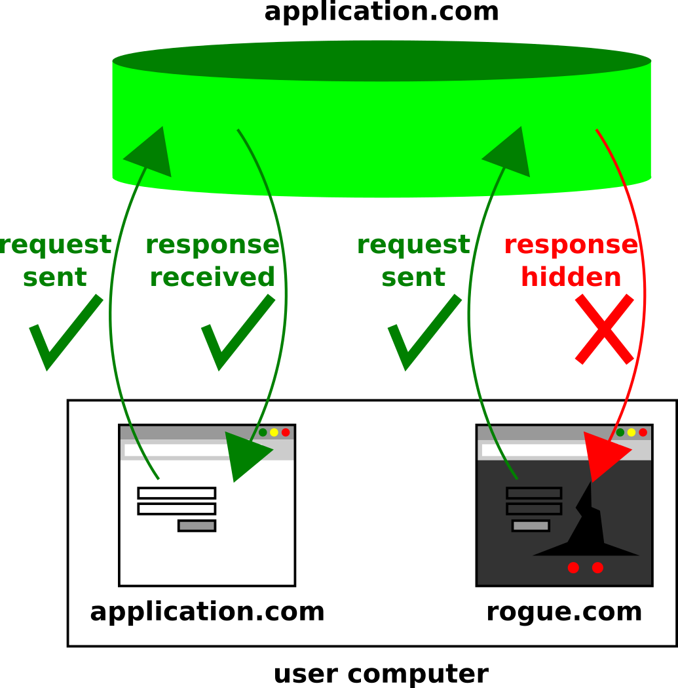

# CSRF, NoSQL Injection and XSS target application

[Versão em Português do Brasil](README.pt-br.md)

This is an example application to demonstrate CSRF, NoSQL Injection and XSS vulnerabilities and protections.

The `master` branch consists of a merge of the `unprotected` branch and the `fix-*` branches, which means that it contains code that, at least in theory, is protected against the three types of attacks already mentioned. In case you discover any flaws, I would be more than happy to know about them on the Issues page of this project!

---

## Features

The application itself is quite simple, with the following public (non-authenticated) features:
* Home page
* User search
* Login

After authentication, additional access to the user registration, listing and deletion page is obtained.

A copy of the Insomnia workspace is included in this project (and updated commit to commit), in order to facilitate the discovery and testing of the existing HTTP requests.

---

## Running the application

The app was developed with the aid of ExpressJS framework, thus requiring Node and NPM installed (versions used: 12.13.1 and 6.14.8, respectively) in order to execute the development version. Hence, after cloning the present repository, just use the `npm install` command to install the JavaScript dependencies.

In addition, it is necessary to install MongoDB (version used: 4.4.3). I suggest you to refer to the official documentation as a guide on installing and starting the MongoDB service on the machine. Just make sure that, before running this application, the service is operational — for instance, with the commands `sudo systemctl status mongod` and` sudo systemctl start mongod` (please look up the documentation for the commands specific to your platform).

That done, just use the `npm start` command to start the application. **IMPORTANT**: when changing branches or making modifications to the ExpressJS source code middleware or routes, the application must be reinitialized (`CTRL + C` and `npm start`) to guarantee the execution of the new code. As for the Jade template, this is not necessary, just refresh (`F5` or `Ctrl + F5`) the page in the Web browser.

---

## Attacking the application

The NoSQL Injection attack can be practiced directly in the browser, either through malicious entries (strings) in the form fields (especially in the `alternative-login-implementation` branch), or through scripts executed via the browser Console (normally, the shortcut is `F12`). Another option is the aforementioned Insomnia workspace.

As for the "Cross Site" attacks, by their nature, an ideal environment would be the execution of the [malicious example application](https://github.com/utfpr-cesc/csrf-xss-rogue-website) developed specifically for demonstration of these attacks against the present project. For even more realistic simulation, you must assign a domain name to at least one of the applications, ideally both (e.g. `application.com` and `rogue-website.com`) in the `/etc/hosts` file (or equivalent in your operating system), to ensure that the "victim' browser" perceives two different domain names — as normally occurs in attacks of this kind.

**IMPORTANT**: I recommend using only anonymous browser tabs during the tests, especially when alternating execution of different branches of the application, in order to avoid confusion due to cookies stored in browsers. Each time all anonymous tabs are closed and a new anonymous window is opened, the latter is guaranteed to have no stored cookies, allowing new tests to be carried out without the side effects of the previous ones.

---

## NoSQL Injection

### Summary

NoSQL Injection (NoSQLi) is the NoSQL equivalent of the SQL Injection (SQLi) attack. The attack mechanism is essentially the same: embedding code in user inputs, in order to modify or enhance the result of a database query that utilizes that input. Through NoSQL Injection, the malicious user can, for example, gain access to data that they would normally not have access to. However, like some varieties of SQLi, under some conditions a NoSQLi attack can also cause the database to be slow or completely unavailable. This is particularly true when the NoSQL database allows server-side scripting to embed user (and therefore potentially malicious) input.

### Conditions

The conditions for NoSQLi are created when, while implementing a query against a NoSQL database, the developer:

* Does not validate user entries that are concatenated to the query; OR
* Merges user inputs (validated or not) with scripts interpreted on the server side.

In addition, information that is inadvertently displayed by the application server, such as HTTP `"X-Powered-By"` headers which contain the name of the framework, for example, can facilitate an invasion by allowing the attacker to look up for known flaws on that platform, or by saving him time on the search for the proper syntax for the code being injected.

---

## Cross Site Request Forgery

### Summary

An attacker can resort to "Cross Site" attack techniques when he wants to perform certain modifications in a target application but does not have valid credentials and is unable to obtain them (for example, through SQLi or NoSQLi), or simply when he wants to credit these modifications to a legitimate (victimized) user. In this context, the term "Cross Site" denotes that operations will be triggered by means of external code, originally non-existent in the target application, but which was incorporated due to vulnerabilities in the source code, and executed during the session of a legitimate user (victim).

More specifically, the Cross Site Request Forgery (CSRF) consists of meticulously fabricating HTTP requests against the target application, but firing them from a page controlled by the attacker as soon as it is accessed by a victim logged into the target application. Due to the security policies of modern browsers, in the vast majority of cases the attacker's application does not even get access to the generated HTTP response — however, it is necessary to make clear that such policies do not necessarily prevent the HTTP request from reaching the target server, causing potentially destructive side effects (see Figure 1).

Figure 1 — Differences in behavior of HTTP requests/responses inside and outside the domain

### Conditions

To be successful, this type of attack requires the following conditions:

* From the user's point of view, it is necessary to have an active session in the target application established via cookies with the `SameSite` attribute equal to `'None'` or `'Lax'` (meaning that they get dispatched to the target application even though the HTTP request originated from an external application). `"Lax"` cookies are a little more restrictive than `"None"` cookies, but they still allow CSRF attacks in some circumstances. In Figure 2, when the authentication cookies are sent back to the application domain, the server will consider the user as authenticated for all purposes, meaning that restricted operations will be allowed.
* As for the target application, it is necessary that:
  * The server-side code does not validate the origin of the HTTP request; OR
  * Create session cookies with the values ​​of the `SameSite` attribute already mentioned; AND
  * Do not have an active defense against CSRF, such as anti-CSRF tokens.

Figure 2 — Differences in behavior while sending cookies back to the application server

---

## Cross Site Scripting

### Summary

Another "Cross Site" attack technique is XSS (Cross Site Scripting), which essentially consists of injecting malicious JavaScript into the front-end portion of the target application, that is, that portion that runs directly in the user's browser.

There are two significant differences between CSRF and XSS. The first one is that CSRF is limited to executing HTTP requests against the target application, always from the malicious application, while XSS is already launched within the domain of the target application. The second, arising from the first, is that XSS is not limited to HTTP requests — in reality, it is basically as limited as the authentic scripts of the application, that is, in practice virtually unlimited, not only being able to trigger HTTP requests, but also to read the answers, manipulate DOM (Document Object Model), access browser APIs, make use of JavaScript programming structures, and so on. In this way, all defenses implemented against NoSQLi and CSRF fall apart if the application is vulnerable to XSS.

### Conditions

Although there are some classifications applicable to XSS attacks, in essence they all need a single condition: that the target application incorporates malicious user input into the HTML template, either via server side rendering or via DOM manipulation directly on the front end. This can be done in a number of ways, some definitely not obvious (sometimes with obfuscated code activated without the need for explicit `<script>` tags), which (in addition to the great potential impact) makes this attack quite treacherous and dangerous.
