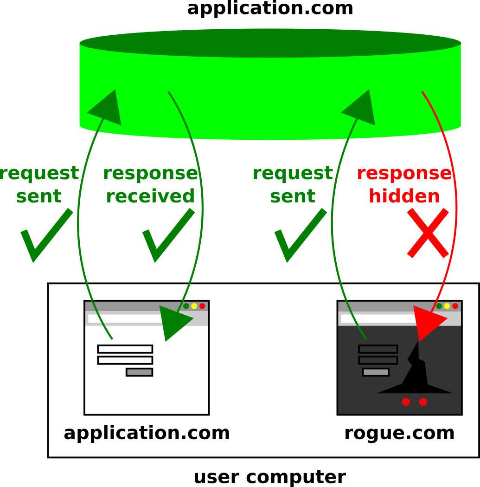

# CSRF, NoSQL Injection and XSS target application

[English version](README.md)

Esta é uma aplicação didática para demonstrar ataques CSRF, NoSQL Injection e XSS, bem como suas defesas.

O branch `master` é uma mescla do branch `unprotected` com os branches `fix-*`, ou seja, contém o código protegido (ao menos em teoria) contra os três tipos de ataques abordados. Se encontrar uma falha, eu ficaria muito feliz de receber seu relato via Issues nesse mesmo projeto!

---

## Funcionalidades

A aplicação em si é bastante simples, com as seguintes funcionalidades públicas (não autenticadas):
* Homepage
* Busca de usuários
* Login

Após autenticação, ganha-se acesso adicional à página de cadastro, listagem e remoção de usuários.

Uma cópia do workspace do Insomnia está inclusa no presente projeto (e atualizada commit a commit), de forma a permitir a descoberta e o teste das requisições HTTP existentes.

---

## Como executar

A aplicação foi desenvolvida no framework ExpressJS, necessitando portanto do Node e do NPM instalados (versões utilizadas: 12.13.1 e 6.14.8, respectivamente) para executar a versão de desenvolvimento. Dessa forma, após clonagem do presente repositório, basta utilizar o comando `npm install` para instalar as dependências de JavaScript.

Além disso, é necessário instalar o MongoDB (versão utilizada: 4.4.3). Indico a documentação oficial como o melhor guia para instalação e inicialização do serviço do MongoDB na máquina. Ressalto apenas que, antes de executar a presente aplicação, é necessário garantir que o serviço esteja operante — por exemplo, com os comandos `sudo systemctl status mongod` e `sudo systemctl start mongod` (favor consultar os comandos específicos para sua plataforma).

Feito isso, basta utilizar o comando `npm start` para inicializar a aplicação. **IMPORTANTE**: ao trocar de branch ou realizar modificações nos middlewares e rotas do código-fonte ExpressJS, deve-se reinicializar a aplicação (`CTRL+C` e `npm start`) para garantir a execução do novo código. Para o template Jade, não há necessidade, bastando atualizar (`F5` ou `Ctrl+F5`) a página no navegador Web.

---

## Como praticar os ataques

O ataque de NoSQL Injection pode ser praticado diretamente no navegador, seja por meio de entradas (strings) maliciosas nos campos de formulário (sobretudo no branch `alternative-login-implementation`), ou então por meio de scripts executados via Console do browser (normalmente, o atalho é `F12`). Outra opção é o já mencionado workspace do Insomnia.

Quanto aos ataques "Cross Site", pela sua natureza, um ambiente ideal seria a execução da [aplicação maliciosa de exemplo](https://github.com/utfpr-cesc/csrf-xss-rogue-website) desenvolvida especialmente para demonstração desses ataques contra o presente projeto. Para simulação ainda mais realista, deve-se atribuir um nome de domínio a ao menos uma das aplicações, idealmente às duas (ex.: `application.com` e `rogue-website.com`) no arquivo `/etc/hosts` (ou equivalente em seu sistema operacional), de modo a garantir que o navegador do usuário "vítima" perceba dois nomes de domínio diferentes — como normalmente acontece em ataques do gênero.

**IMPORTANTE**: recomendo utilizar apenas abas anônimas nos testes, principalmente ao alternar execução de diferentes branches da aplicação, de modo a evitar confusões devido a cookies armazenados nos browsers. Cada vez que todas as abas anônimas são fechadas e uma nova janela anônima é aberta, esta última vem garantidamente sem nenhum cookie armazenado, permitindo que novos testes sejam realizados sem efeitos colaterais dos anteriores.

---

## NoSQL Injection

### Resumo

O NoSQL Injection (NoSQLi) é o equivalente NoSQL do ataque SQL Injection (SQLi). O mecanismo de ataque é essencialmente o mesmo: embutir código em entradas de usuário, de modo a modificar ou ampliar o resultado de uma consulta ao banco de dados que faça uso dessa entrada. Através do NoSQL Injection, o usuário mal intencionado pode, por exemplo, ganhar acesso a dados a que normalmente não teria acesso. No entanto, assim como algumas variedades do SQLi, sob algumas condições um ataque de NoSQLi podem também causar lentidão ou completa indisponibilidade do banco de dados. Isso é verdade, em particular, quando o banco de dados NoSQL permite a interpretação no lado servidor de script que embute entrada de usuário (e, portanto, potencialmente maliciosa).

### Condições

As condições para o NoSQLi são criadas quando, ao implementar uma consulta a um banco de dados NoSQL, o desenvolvedor:

* Não valida entradas de usuário que são concatenadas à consulta; OU
* Mescla entradas de usuário (validadas ou não) com scripts interpretados no lado servidor.

Além disso, informações que sejam inadvertidamente mostradas pelo servidor da aplicação, como cabeçalhos HTTP `"X-Powered-By"` contendo o nome do framework, por exemplo, podem facilitar uma invasão ao permitir que o atacante busque falhas conhecidas daquela plataforma, ou que ganhe tempo para encontrar a sintaxe adequada para os códigos a serem injetados.

---

## Cross Site Request Forgery

### Resumo

Um atacante pode recorrer a técnicas de ataque "Cross Site" quando quer efetuar certas alterações em uma aplicação alvo mas não possui credenciais válidas e não consegue obtê-las (por exemplo, através de SQLi ou de NoSQLi), ou simplesmente quando deseja que as alterações fiquem registradas sob as credenciais de outro usuário. Nesse contexto, o termo "Cross Site" denota que as operações serão acionadas por meio de código externo, originalmente inexistente na aplicação, mas que foi incorporado devido a vulnerabilidades existentes no código-fonte, e executado durante a sessão de um usuário legítimo (vítima).

Mais especificamente, o Cross Site Request Forgery (CSRF) consiste da fabricação minuciosa de requisições HTTP contra a aplicação alvo, porém disparando-as de uma página controlada pelo atacante assim que ela for acessada por uma vítima logada na aplicação alvo. Devido a políticas de segurança dos browsers modernos, na enorme maioria dos casos a aplicação do atacante nem ao menos consegue acesso à resposta HTTP gerada — no entanto, é necessário deixar claro que tais políticas não necessariamente impedem que a requisição HTTP chegue ao servidor alvo, provocando efeitos colaterais potencialmente destrutivos (ver Figura 1).

Figura 1 — Diferenças de comportamento de requisições/respostas HTTP dentro e fora do domínio

### Condições

Para lograr êxito, tal modalidade de ataque necessita das seguintes condições:

* Do ponto de vista do usuário, é necessário possuir uma sessão ativa com a aplicação alvo, conexão esta estabelecida via cookies com atributo `SameSite` igual a `'None'` ou `'Lax'` (ou seja, que são disparados para a aplicação alvo mesmo que a requisição HTTP tenha se originado em uma aplicação externa). Cookies "Lax" são um pouco mais restritivos em relação aos cookies "None", mas ainda permitem ataques CSRF em algumas circunstâncias. Na Figure 2, quando os cookies de autenticação são enviados de volta à aplicação geradora, o servidor considerará o usuário logado para todas as finalidades, significando que operações restritas serão autorizadas.
* Quanto à aplicação alvo, é necessário que:
  * O código de lado servidor não valide a origem da requisição HTTP; OU
  * Crie os cookies de sessão com os valores do atributo `SameSite` já mencionados; E
  * Não possua uma defesa ativa contra CSRF, como por exemplo tokens anti-CSRF.

Figura 2 — Diferenças no envio de cookies recebidos de um domínio em requisições HTTP dentro e fora desse domínio

---

## Cross Site Scripting

### Resumo

Outra técnica de ataque "Cross Site" é o XSS (Cross Site Scripting), que consiste essencialmente de injetar um JavaScript malicioso na porção front end da aplicação alvo, ou seja, aquela porção que executa diretamente no browser do usuário.

Há duas diferenças significativas entre o CSRF e o XSS. A primeira delas é que o CSRF se limita à execução de requisições HTTP contra a aplicação alvo, sempre a partir da aplicação maliciosa, enquanto o XSS é disparado já dentro do domínio do aplicação alvo. A segunda, decorrente da primeira, é que o XSS não se limita a requisições HTTP — na realidade, é basicamente tão limitado quanto os scripts autênticos da aplicação, ou seja, na prática virtualmente ilimitado, podendo não só disparar requisições HTTP, como também ler as respostas, manipular o DOM (Document Object Model), acessar APIs do browser, fazer uso de estruturas de programação JavaScript, e assim por diante. Desse modo, todas as defesas implementadas contra NoSQLi e CSRF caem por terra caso a aplicação fique vulnerável a XSS.

### Condições

Apesar de que existem algumas classificações aplicáveis a ataques XSS, em essência todos necessitam de uma única condição: que a aplicação alvo incorpore uma entrada de usuário maliciosa ao template HTML, seja via server side rendering ou via manipulação de DOM diretamente no front end. Isso pode ser feito de várias maneiras, algumas definitivamente nada óbvias (por vezes com código obfuscado e ativado sem a necessidade de tags `<script>` explícitas), o que (em adição ao grande impacto potencial) torna esse ataque bastante traiçoeiro e perigoso.
